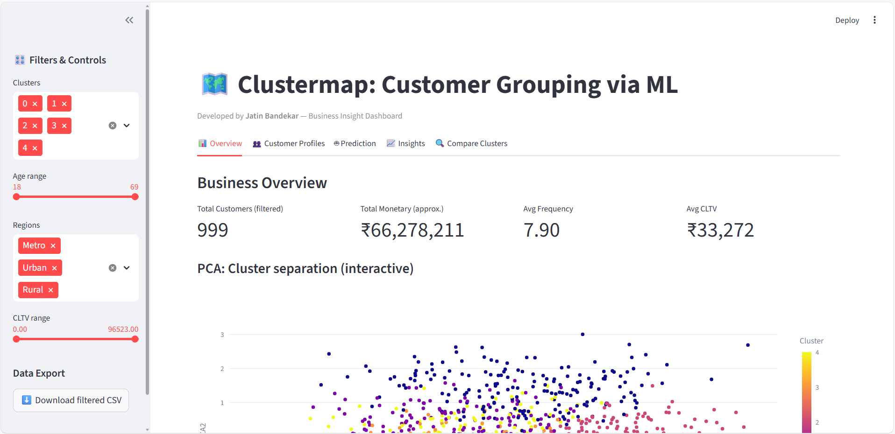
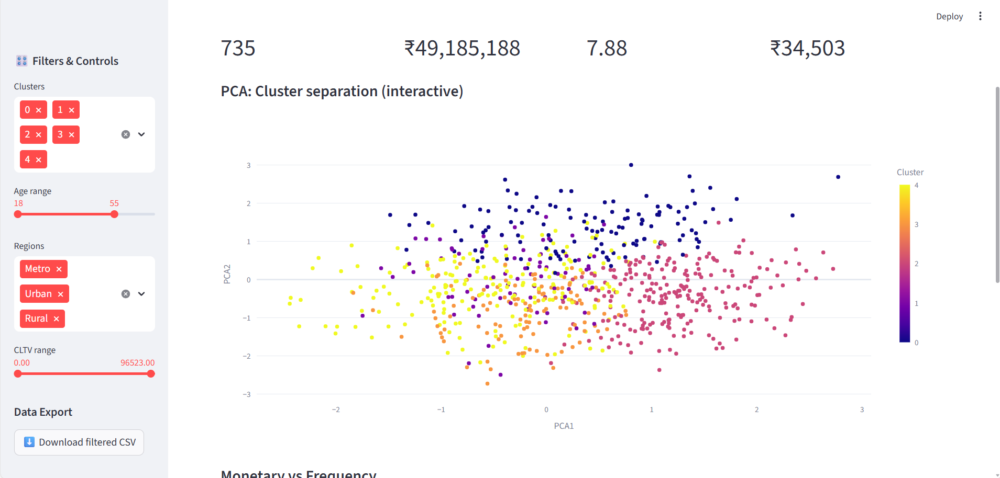
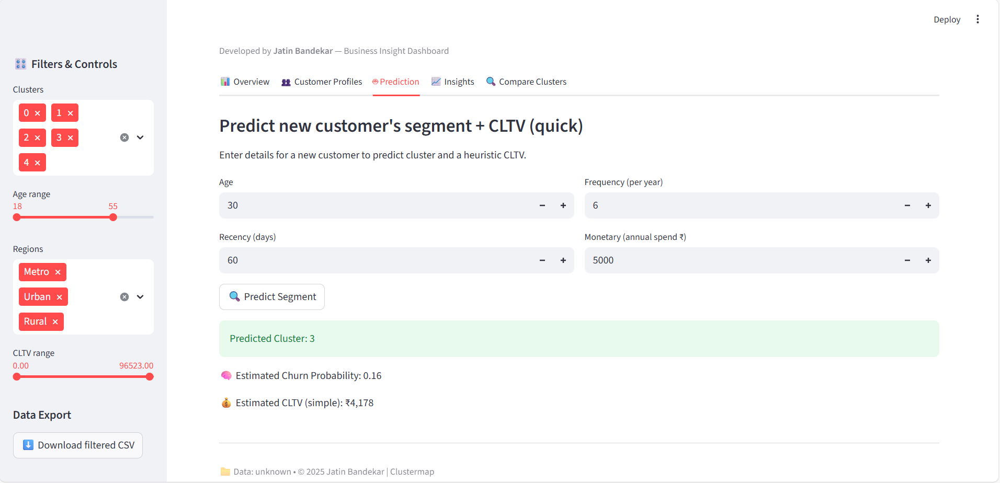
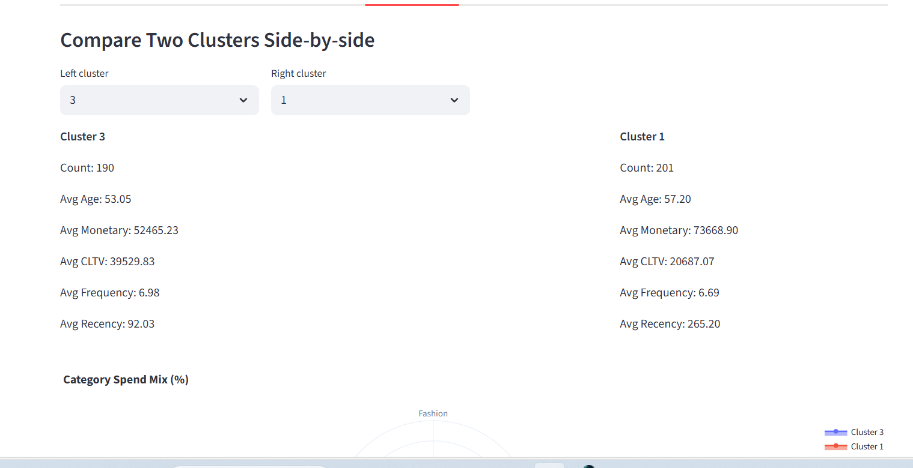
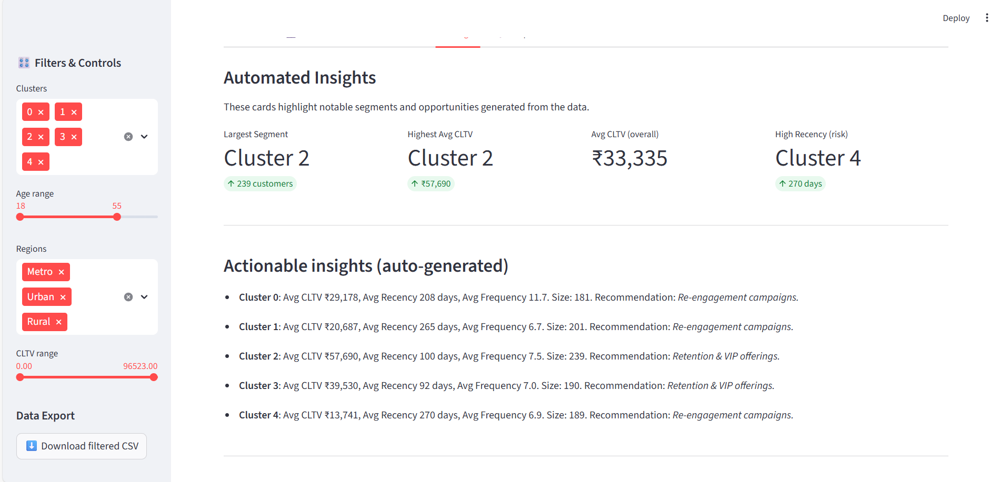

# 🧠 Clustermap: Customer Grouping via ML

### 🚀 Smart Customer Insights Dashboard

Built with **Streamlit**, **Plotly**, and **scikit-learn**, this interactive project helps businesses understand customers better through **data-driven segmentation, visual analytics, and predictive insights**.

> 👨‍💻 Developed by **Jatin Bandekar** | Data Analytics & Machine Learning Project

---

## 📋 Overview

**Clustermap** leverages **K-Means Clustering** to segment customers based on key behavior metrics such as **Age**, **Recency**, **Frequency**, and **Monetary Value**.
The dashboard reveals actionable insights for targeted marketing, churn reduction, and customer retention — all in a clean, visual, and interactive format.


## 🎯 Objectives

* Segment customers using **unsupervised learning (K-Means)**
* Visualize cluster behavior and demographics
* Estimate **Customer Lifetime Value (CLTV)** and **Churn Probability**
* Compare customer groups interactively
* Provide business-driven insights through data

---

## 🧰 Tech Stack

| Category             | Tools           |
| -------------------- | --------------- |
| **Language**         | Python          |
| **Machine Learning** | K-Means, PCA    |
| **Data Handling**    | Pandas, NumPy   |
| **Visualization**    | Plotly, Seaborn |
| **Web Framework**    | Streamlit       |
| **Version Control**  | Git, GitHub     |

---

## 📊 Dataset

**Filename:** `ecommerce_customer_data_full.csv`
**Attributes used:**

* Age
* Recency (Days since last purchase)
* Frequency (Transactions per year)
* Monetary (Annual spending in ₹)
* Category spends (Electronics, Fashion, Grocery, Lifestyle)
* Region, Gender, CustomerID

📁 *Source:* Public synthetic e-commerce dataset inspired by Kaggle.

---

## 🖥️ Dashboard Features

| Feature                      | Description                                                                  |
| ---------------------------- | ---------------------------------------------------------------------------- |
| 📈 **Business Overview**     | Real-time KPIs and interactive visualizations for customer behavior.         |
| 👥 **Customer Profiles**     | Cluster-based segmentation with spend analysis, CLTV, and churn insights.    |
| 🤖 **Smart Prediction Tool** | Predicts new customer cluster, CLTV, and churn risk.                         |
| 💹 **Cluster Comparison**    | Compare multiple customer clusters side by side.                             |
| 🔍 **Insight Generator**     | Auto-generated business personas & marketing recommendations for each group. |
| ⬇️ **Data Export**           | Download filtered or clustered customer data for business use.               |

---

## 📸 Screenshots

> Add the following screenshots after running your app (`streamlit run app.py`):

| Section               | Preview                                              |
| --------------------- | ---------------------------------------------------- |
| ##🏠 Dashboard Home     |      |
| ##📊 PCA Cluster Plot   |         |
| ##👥 Customer Profiles  |    |
| ##🤖 Prediction Tool    |        |
| ##💹 Cluster Comparison |  |
| ##💡 Insight Generator  |    |

---

## ⚙️ Installation & Setup

### 🔽 Step 1: Clone the Repository

```bash
git clone https://github.com/jatinAB/clustermap-customer-segmentation.git
cd clustermap-customer-segmentation
```

### 📦 Step 2: Install Requirements

```bash
pip install -r requirements.txt
```

### ▶️ Step 3: Run the App

```bash
streamlit run app.py
```

---

## 📈 Sample Output

Example Cluster Interpretation:

| Cluster | Label                | Description                           | Suggested Marketing Strategy |
| ------- | -------------------- | ------------------------------------- | ---------------------------- |
| 0       | Loyal Shoppers       | High frequency, high CLTV             | Exclusive loyalty rewards    |
| 1       | High-Value Wanderers | High spend, low frequency             | Retargeting campaigns        |
| 2       | Trend Seekers        | Young, spend evenly across categories | Social media ads             |
| 3       | Value Maximizers     | Budget-conscious, frequent small buys | Discount bundles             |
| 4       | New Entrants         | Recently acquired customers           | Welcome offers & onboarding  |


## 🔮 Future Enhancements

* 📊 Integration with live marketing data APIs
* 📈 Customer churn forecasting using ML
* 🌍 Deploy to Streamlit Cloud or Hugging Face Spaces
* 📬 Add automated email campaign insights

---

## 👤 Author

**Jatin Bandekar**
📍 India
💼 Data Analytics | Machine Learning | Artificial Intelligence | AI Automation
📧 [Email Me](mailto:bandekarjatin02@gmail.com)
🌐 [GitHub](https://github.com/jatinAB) 
---

Would you like me to **generate the image placeholders (blank dashboard screenshots with labels)** automatically for your assets folder?
That way, you can just replace them later with real screenshots once you run your app.
